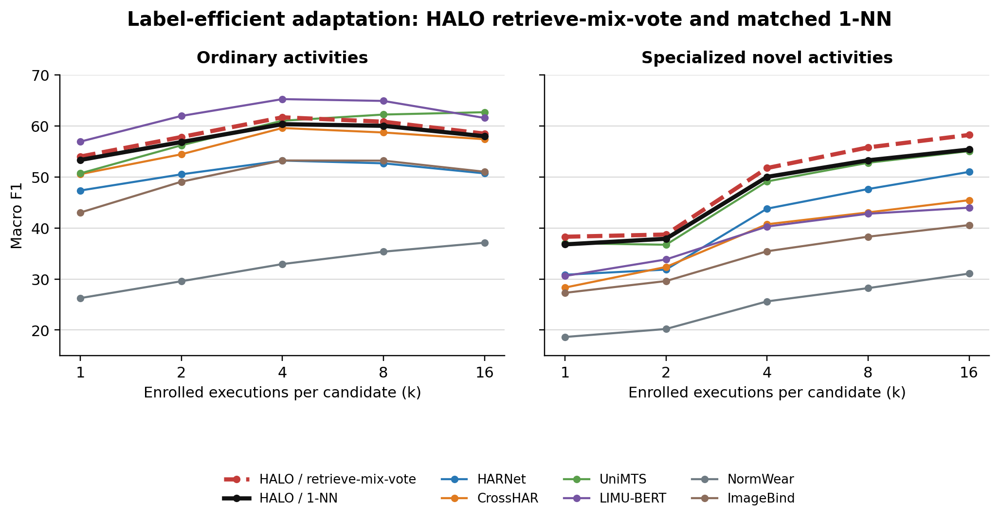
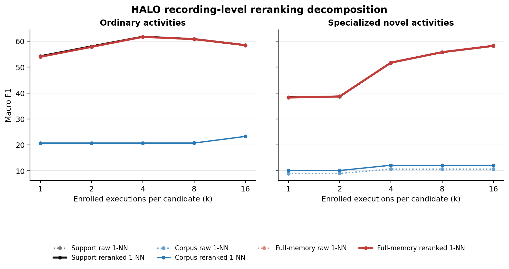

# Latest Completed Results

> Last updated 2026-08-24. These measurements belong to the completed pairwise recording-reranker
> checkpoint named below. The active code now uses a contextual scalar reranker with C=2/4/8/16;
> it has passed smoke testing but has not yet produced a full result. Do not attribute these numbers
> to the new mixer.

**Result set:** `PB-03-PAIRWISE-1NN`. See the
[`Phase-B Version Registry`](PHASE_B_TRAINING_STATUS.md) for the exact checkpoint hash and for how it
differs from the active `PB-04-SET-SCALAR-1NN` architecture.

## Protocol

The latest completed checkpoint is
`training/tokenizer/outputs/e2e_recording_rerank_35k_v3_20260824/best.pt`. It was trained end to end
from random initialization for 35,000 steps and selected at step 33,000 using the predeclared
development metric. Training used partial-enrollment episodes with candidate counts 8, 16, 32, and
64. Each episode queried four labels and enrolled both queried labels and distractors so that the
presence of enrollment did not reveal the answer.

External evaluation uses the sealed `adaptation_v1` manifest: seven held-out datasets, five seeds,
execution-disjoint support and query sets, and no test-set training. Here `k` has the standard N-way
k-shot meaning: every candidate receives exactly `k` independent enrolled executions. The query
cohort and candidate roster remain fixed across k. Macro F1 is averaged within each dataset and then
equally across datasets.

The strict assembler validated 20,957 cells. Generated tables are in
[`../../eval/adaptation_tables/e2e_recording_rerank_35k_v3_20260824/headline_tables.md`](../../eval/adaptation_tables/e2e_recording_rerank_35k_v3_20260824/headline_tables.md),
and the raw HALO decomposition is in
[`../../eval/adaptation_results/e2e_recording_rerank_35k_v3_20260824/halo_engine_decomposition.json`](../../eval/adaptation_results/e2e_recording_rerank_35k_v3_20260824/halo_engine_decomposition.json).

## Zero-Shot Recognition

No labelled target-dataset execution is available at k=0. Each model uses its native zero-shot
mechanism.

| model | ordinary | specialized novel |
|---|---:|---:|
| CrossHAR | **37.70** | 11.22 |
| HARNet | 33.82 | 11.40 |
| UniMTS | 31.98 | **17.37** |
| LIMU-BERT | 30.60 | 10.27 |
| **HALO / retrieve-mix-vote** | 20.72 | 9.72 |
| ImageBind | 11.38 | 8.15 |
| NormWear | 5.08 | 3.58 |

HALO is not competitive at k=0. The current design should therefore be described as an enrollment
adaptation system, not as a leading semantic zero-shot classifier.

## Label-Efficient Adaptation

HALO retrieve-mix-vote inference keeps individual six-second recording rows, combines enrollment with its
fixed 512-row corpus memory, applies the learned scalar correction to every query-memory pair, and
chooses the corrected nearest candidate. For every encoder, the table also reports the same three
non-gradient enrollment rules: pooled-execution 1-NN, support prototypes, and closed-form ridge.
Each sees only the enrolled support executions. Linear-head fitting is excluded from the main table.

### Ordinary activities

| model / readout | k=1 | k=2 | k=4 | k=8 | k=16 |
|---|---:|---:|---:|---:|---:|
| **HALO / retrieve-mix-vote** | 53.99 | 57.82 | 61.68 | 60.81 | 58.48 |
| HALO / 1-NN | 53.32 | 56.83 | 60.33 | 60.01 | 57.97 |
| HALO / prototype | 53.32 | 55.50 | 58.10 | 57.56 | 55.74 |
| HALO / ridge | 52.83 | 56.09 | 60.18 | 60.80 | 58.07 |
| LIMU-BERT / 1-NN | 56.91 | **61.95** | **65.24** | **64.89** | 61.55 |
| LIMU-BERT / prototype | **56.91** | 60.19 | 63.84 | 63.06 | 59.18 |
| LIMU-BERT / ridge | 50.23 | 53.46 | 58.41 | 57.85 | 55.06 |
| UniMTS / 1-NN | 50.69 | 56.20 | 61.01 | 62.22 | **62.68** |
| UniMTS / prototype | 50.69 | 52.27 | 55.79 | 55.99 | 54.62 |
| UniMTS / ridge | 47.66 | 49.84 | 53.62 | 54.67 | 54.16 |
| CrossHAR / 1-NN | 50.54 | 54.43 | 59.58 | 58.70 | 57.39 |
| CrossHAR / prototype | 50.54 | 54.04 | 58.17 | 56.69 | 55.61 |
| CrossHAR / ridge | 42.99 | 45.84 | 50.32 | 50.62 | 50.38 |
| HARNet / 1-NN | 47.34 | 50.51 | 53.20 | 52.66 | 50.69 |
| HARNet / prototype | 47.34 | 49.52 | 52.93 | 52.39 | 50.40 |
| HARNet / ridge | 46.73 | 49.16 | 53.55 | 53.97 | 52.73 |
| ImageBind / 1-NN | 43.02 | 49.06 | 53.22 | 53.19 | 51.02 |
| ImageBind / prototype | 43.02 | 47.12 | 48.70 | 46.39 | 44.54 |
| ImageBind / ridge | 42.92 | 48.16 | 51.75 | 51.71 | 49.71 |
| NormWear / 1-NN | 26.26 | 29.56 | 32.92 | 35.35 | 37.11 |
| NormWear / prototype | 26.26 | 27.17 | 28.82 | 28.80 | 27.83 |
| NormWear / ridge | 20.68 | 19.99 | 20.76 | 21.59 | 23.89 |

### Specialized novel activities

| model / readout | k=1 | k=2 | k=4 | k=8 | k=16 |
|---|---:|---:|---:|---:|---:|
| **HALO / retrieve-mix-vote** | **38.28** | **38.71** | **51.74** | **55.78** | **58.22** |
| HALO / 1-NN | 36.78 | 37.88 | 50.00 | 53.25 | 55.35 |
| HALO / prototype | 36.78 | 37.06 | 49.16 | 51.11 | 52.78 |
| HALO / ridge | 35.61 | 36.14 | 49.17 | 52.85 | 57.74 |
| LIMU-BERT / 1-NN | 30.58 | 33.83 | 40.28 | 42.78 | 43.97 |
| LIMU-BERT / prototype | 30.58 | 33.36 | 38.76 | 40.38 | 41.66 |
| LIMU-BERT / ridge | 27.56 | 30.75 | 36.07 | 38.25 | 40.39 |
| UniMTS / 1-NN | 37.02 | 36.71 | 49.12 | 52.77 | 55.05 |
| UniMTS / prototype | 37.02 | 36.49 | 47.87 | 50.19 | 50.91 |
| UniMTS / ridge | 34.39 | 34.78 | 46.71 | 50.28 | 52.85 |
| CrossHAR / 1-NN | 28.32 | 32.36 | 40.73 | 43.04 | 45.44 |
| CrossHAR / prototype | 28.32 | 32.46 | 40.97 | 43.38 | 44.74 |
| CrossHAR / ridge | 26.77 | 31.03 | 40.46 | 43.31 | 45.79 |
| HARNet / 1-NN | 30.83 | 31.84 | 43.78 | 47.62 | 50.98 |
| HARNet / prototype | 30.83 | 31.55 | 41.69 | 44.19 | 45.91 |
| HARNet / ridge | 30.12 | 31.66 | 43.82 | 48.89 | 54.03 |
| ImageBind / 1-NN | 27.29 | 29.59 | 35.43 | 38.29 | 40.56 |
| ImageBind / prototype | 27.29 | 29.84 | 34.15 | 36.04 | 37.15 |
| ImageBind / ridge | 26.24 | 29.85 | 35.15 | 39.35 | 43.00 |
| NormWear / 1-NN | 18.63 | 20.20 | 25.61 | 28.21 | 31.06 |
| NormWear / prototype | 18.63 | 18.14 | 21.50 | 21.76 | 21.05 |
| NormWear / ridge | 14.68 | 14.24 | 18.43 | 19.35 | 19.67 |

Retrieve-mix-vote beats HALO pooled-execution 1-NN at every k. The gain is 0.51-1.35 F1 on
ordinary activities and 0.83-2.87 F1 on specialized activities. HALO leads all compared methods on
specialized activities, but LIMU-BERT remains strongest on ordinary activities through k=8.

## Reranker Decomposition

The native-versus-pooled comparison does not isolate learning because the native path preserves
multiple recording rows per enrolled execution and also includes corpus memory. The matched
decomposition below compares raw and learned scores while holding those inputs fixed. Values are
means over k=1,2,4,8,16 after equal dataset weighting.

| memory available | ordinary raw | ordinary reranked | specialized raw | specialized reranked |
|---|---:|---:|---:|---:|
| Enrollment only | 58.60 | 58.66 | 48.59 | 48.56 |
| Corpus only | 21.23 | 21.23 | 9.98 | 11.34 |
| Enrollment + corpus | 58.50 | 58.56 | 48.57 | 48.55 |

The learned correction is nearly neutral on the full deployed path: +0.06 ordinary and -0.02
specialized F1 relative to exact raw full-memory 1-NN. It improves weak corpus-only retrieval on
specialized activities, but that path remains far below enrollment retrieval. The demonstrated
native gain therefore comes primarily from retaining individual recording rows rather than pooling
each execution, not from learned reranking. This run does not yet establish that the learned
reranker adds useful adaptation beyond a carefully matched raw nearest-neighbor rule.

## Training Health

The repaired run completed without a non-finite loss or gradient. Development macro F1 rose from
0.0910 before training to a best of 0.2441 at step 33,000, then ended at 0.2386 at step 35,000. The
reranker's development margin over its exact raw full-memory control was also small: +0.0039 at the
selected checkpoint. This is mild late overfitting rather than early convergence.

Total wall time was 97.5 minutes under the code used for this recorded run: 29.8 minutes constructing
280,000 deterministic episode plans and approximately 67.7 minutes for initialization, validation,
and GPU training. The planner has since been made deterministic-parallel and cacheable without
changing episode semantics. A real-corpus benchmark projects about 6 minutes of cold setup and 2
minutes of warm setup; per-step CPU data preparation remains the main training-time limitation.

## Current Conclusion

The simplified model fixes the severe degradation caused by the retired attention mixer and gives a
small, consistent headline advantage over pooled-execution 1-NN. It also provides the strongest
tested representation/readout combination for specialized novel activities. However, the exact
decomposition does not show a meaningful learned-reranking advantage, and zero-shot recognition is
weak. The next experiment should compare the deployed full-memory reranker directly against the
same recording-level raw 1NN objective during model selection and training, rather than using the
pooled-execution control as the optimization reference.
