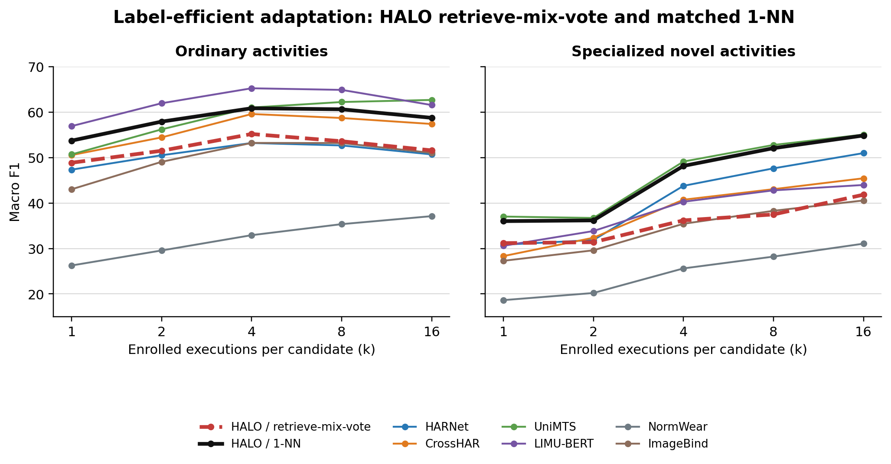

# Current Best Results

> Last updated 2026-08-24. `PB-04-SET-SCALAR-1NN` is the promoted HALO checkpoint because it gives
> the strongest zero-shot result and a small ordinary-activity 1-NN improvement. Its deployed
> enrollment readout is 1-NN; retrieve-mix-vote is retained and reported as an auxiliary ablation.

**Result set:** `PB-04-SET-SCALAR-1NN` selected checkpoint. See the
[`Phase-B Version Registry`](PHASE_B_TRAINING_STATUS.md) for the exact checkpoint hash and for how it
differs from the previous `PB-03-PAIRWISE-1NN` model.

## Protocol

The promoted checkpoint is
`training/tokenizer/outputs/e2e_pb04_fixed_filterbank_35k_20260824/best.pt`. It was trained end to
end from random initialization for 35,000 steps and selected at step 10,000 using the predeclared
development metric. Training used partial-enrollment episodes with candidate counts 2, 4, 8, and
16. Each episode queried up to four labels and enrolled queried labels and distractors independently.

External evaluation uses the sealed `adaptation_v1` manifest: seven held-out datasets, five seeds,
execution-disjoint support and query sets, and no test-set training. Here `k` has the standard N-way
k-shot meaning: every candidate receives exactly `k` independent enrolled executions. The query
cohort and candidate roster remain fixed across k. Macro F1 is averaged within each dataset and then
equally across datasets.

The strict assembler validated 7,997 coherent-label cells. Generated aggregate and per-dataset
tables are in
[`../../eval/adaptation_tables/e2e_set_scalar_1nn_35k_20260824_best_full/headline_tables.md`](../../eval/adaptation_tables/e2e_set_scalar_1nn_35k_20260824_best_full/headline_tables.md).

## Zero-Shot Recognition

No labelled target-dataset execution is available at k=0. Each model uses its native zero-shot
mechanism.

| model | ordinary | specialized novel |
|---|---:|---:|
| CrossHAR | **37.70** | 11.22 |
| HARNet | 33.82 | 11.40 |
| UniMTS | 31.98 | **17.37** |
| LIMU-BERT | 30.60 | 10.27 |
| **HALO PB-04** | 26.99 | 11.32 |
| ImageBind | 11.38 | 8.15 |
| NormWear | 5.08 | 3.58 |

HALO is not competitive at k=0. The current design should therefore be described as an enrollment
adaptation system, not as a leading semantic zero-shot classifier.

## Label-Efficient Adaptation

HALO retrieve-mix-vote inference keeps individual six-second recording rows, combines enrollment with its
fixed 512-row corpus memory, applies the learned scalar correction to every query-memory pair, and
chooses the corrected nearest candidate. For every encoder, the table also reports the same three
non-gradient enrollment rules: pooled-execution 1-NN, support prototypes, and closed-form ridge.
Each sees only the enrolled support executions. Linear-head fitting is excluded from the main table.

### Ordinary activities

| model / readout | k=1 | k=2 | k=4 | k=8 | k=16 |
|---|---:|---:|---:|---:|---:|
| HALO / retrieve-mix-vote | 48.86 | 51.50 | 55.18 | 53.59 | 51.58 |
| **HALO / 1-NN** | 53.72 | 57.91 | 60.85 | 60.62 | 58.74 |
| HALO / prototype | 53.72 | 57.82 | 58.82 | 59.01 | 55.22 |
| HALO / ridge | 52.53 | 56.47 | 57.93 | 58.19 | 55.78 |
| LIMU-BERT / 1-NN | 56.91 | **61.95** | **65.24** | **64.89** | 61.55 |
| LIMU-BERT / prototype | **56.91** | 60.19 | 63.84 | 63.06 | 59.18 |
| LIMU-BERT / ridge | 50.23 | 53.46 | 58.41 | 57.85 | 55.06 |
| UniMTS / 1-NN | 50.69 | 56.20 | 61.01 | 62.22 | **62.68** |
| UniMTS / prototype | 50.69 | 52.27 | 55.79 | 55.99 | 54.62 |
| UniMTS / ridge | 47.66 | 49.84 | 53.62 | 54.67 | 54.16 |
| CrossHAR / 1-NN | 50.54 | 54.43 | 59.58 | 58.70 | 57.39 |
| CrossHAR / prototype | 50.54 | 54.04 | 58.17 | 56.69 | 55.61 |
| CrossHAR / ridge | 42.99 | 45.84 | 50.32 | 50.62 | 50.38 |
| HARNet / 1-NN | 47.34 | 50.51 | 53.20 | 52.66 | 50.69 |
| HARNet / prototype | 47.34 | 49.52 | 52.93 | 52.39 | 50.40 |
| HARNet / ridge | 46.73 | 49.16 | 53.55 | 53.97 | 52.73 |
| ImageBind / 1-NN | 43.02 | 49.06 | 53.22 | 53.19 | 51.02 |
| ImageBind / prototype | 43.02 | 47.12 | 48.70 | 46.39 | 44.54 |
| ImageBind / ridge | 42.92 | 48.16 | 51.75 | 51.71 | 49.71 |
| NormWear / 1-NN | 26.26 | 29.56 | 32.92 | 35.35 | 37.11 |
| NormWear / prototype | 26.26 | 27.17 | 28.82 | 28.80 | 27.83 |
| NormWear / ridge | 20.68 | 19.99 | 20.76 | 21.59 | 23.89 |

### Specialized novel activities

| model / readout | k=1 | k=2 | k=4 | k=8 | k=16 |
|---|---:|---:|---:|---:|---:|
| HALO / retrieve-mix-vote | 31.18 | 31.38 | 36.18 | 37.48 | 41.83 |
| **HALO / 1-NN** | 36.01 | 36.18 | 48.16 | 52.07 | 54.85 |
| HALO / prototype | 36.01 | 35.86 | 45.16 | 46.98 | 48.49 |
| HALO / ridge | 35.65 | 35.21 | 46.70 | 51.37 | **56.41** |
| LIMU-BERT / 1-NN | 30.58 | 33.83 | 40.28 | 42.78 | 43.97 |
| LIMU-BERT / prototype | 30.58 | 33.36 | 38.76 | 40.38 | 41.66 |
| LIMU-BERT / ridge | 27.56 | 30.75 | 36.07 | 38.25 | 40.39 |
| UniMTS / 1-NN | 37.02 | 36.71 | 49.12 | 52.77 | 55.05 |
| UniMTS / prototype | 37.02 | 36.49 | 47.87 | 50.19 | 50.91 |
| UniMTS / ridge | 34.39 | 34.78 | 46.71 | 50.28 | 52.85 |
| CrossHAR / 1-NN | 28.32 | 32.36 | 40.73 | 43.04 | 45.44 |
| CrossHAR / prototype | 28.32 | 32.46 | 40.97 | 43.38 | 44.74 |
| CrossHAR / ridge | 26.77 | 31.03 | 40.46 | 43.31 | 45.79 |
| HARNet / 1-NN | 30.83 | 31.84 | 43.78 | 47.62 | 50.98 |
| HARNet / prototype | 30.83 | 31.55 | 41.69 | 44.19 | 45.91 |
| HARNet / ridge | 30.12 | 31.66 | 43.82 | 48.89 | 54.03 |
| ImageBind / 1-NN | 27.29 | 29.59 | 35.43 | 38.29 | 40.56 |
| ImageBind / prototype | 27.29 | 29.84 | 34.15 | 36.04 | 37.15 |
| ImageBind / ridge | 26.24 | 29.85 | 35.15 | 39.35 | 43.00 |
| NormWear / 1-NN | 18.63 | 20.20 | 25.61 | 28.21 | 31.06 |
| NormWear / prototype | 18.63 | 18.14 | 21.50 | 21.76 | 21.05 |
| NormWear / ridge | 14.68 | 14.24 | 18.43 | 19.35 | 19.67 |

PB-04's 1-NN readout is the promoted enrollment mechanism. Retrieve-mix-vote is below 1-NN at every
k and is reported to make that negative result explicit. LIMU-BERT remains strongest on ordinary
activities through k=8, while PB-04 is competitive with UniMTS on specialized activities.

## Per-Dataset Performance

The complete per-dataset report contains native zero-shot results and separate `retrieve-mix-vote`,
1-NN, prototype, and ridge curves for every model on all seven held-out datasets:
[`headline_tables.md`](../../eval/adaptation_tables/e2e_set_scalar_1nn_35k_20260824_best_full/headline_tables.md#3-per-dataset-performance).
The promoted HALO mechanism is summarized below; `n/a` means the sealed protocol could not form the
requested support count without reusing an execution.

| dataset | k=0 | k=1 | k=2 | k=4 | k=8 | k=16 |
|---|---:|---:|---:|---:|---:|---:|
| Inclusive-HAR | 23.21 | 34.90 | 37.09 | 38.24 | 41.96 | 43.85 |
| MoniPar | 15.19 | 38.40 | 41.80 | 38.09 | 41.08 | 43.47 |
| SPAR | 15.35 | 52.02 | 52.48 | 58.23 | 63.05 | 66.23 |
| TNDA-HAR | 46.21 | 59.07 | 63.91 | 68.69 | 72.12 | 76.34 |
| Upper Limb Use | 3.43 | 17.61 | 14.25 | n/a | n/a | n/a |
| USC-HAD | 14.64 | 56.26 | 60.81 | 63.75 | 53.18 | 56.03 |
| UT Complex | 23.88 | 64.65 | 69.83 | 72.70 | 75.21 | n/a |

## Checkpoint And Readout Selection

PB-04 trained for 35,000 steps in 4,314 seconds. The predeclared development metric selected step
10,000. Both that checkpoint and the final step were evaluated on the same sealed manifest. Values
below are mean macro F1; positive-k columns average k=1,2,4,8,16.

| checkpoint / readout | ordinary k=0 | ordinary k>0 | specialized k=0 | specialized k>0 |
|---|---:|---:|---:|---:|
| PB-03 retrieve-mix-vote | 20.72 | **58.56** | 9.72 | **48.55** |
| PB-03 1-NN | - | 57.69 | - | 46.65 |
| PB-04 best retrieve-mix-vote | 26.99 | 52.14 | 11.32 | 35.61 |
| PB-04 best 1-NN | - | 58.37 | - | 45.45 |
| PB-04 last retrieve-mix-vote | 29.44 | 46.59 | 8.12 | 25.97 |
| PB-04 last 1-NN | - | 56.89 | - | 45.34 |

PB-04 is promoted for its stronger zero-shot performance. Its selected encoder is also modestly
better under ordinary 1-NN (+0.67 F1), although specialized 1-NN is lower (-1.20 F1). The learned
mechanism is far below its own 1-NN control, and late training makes that gap larger. Therefore the
promoted model is PB-04 with 1-NN enrollment, not PB-04 retrieve-mix-vote. Full tables are in
[`e2e_set_scalar_1nn_35k_20260824_best_full/headline_tables.md`](../../eval/adaptation_tables/e2e_set_scalar_1nn_35k_20260824_best_full/headline_tables.md).

## Learned Readout Finding

Across both regimes and every k, PB-04 retrieve-mix-vote is below PB-04 1-NN. This is consistent
with the prior PB-03 decomposition, where most of the apparent native gain came from retaining
individual recording rows rather than from learned score correction. No current experiment shows
that a learned Phase-B mixer improves a matched nearest-neighbor decision.

## Training Health

PB-04 completed 35,000 finite steps in 71.9 minutes. Development macro F1 rose from 0.2010 before
training to 0.3642 at step 10,000, then ended at 0.3353. External evaluation confirms that the
selected checkpoint is preferable: the final checkpoint loses 3.6-6.8 F1 on ordinary
retrieve-mix-vote and 7.2-13.3 F1 on specialized retrieve-mix-vote. Encoder-only 1-NN changes much
less, so late training primarily overfits the learned correction.

## Current Conclusion

PB-04 is the current best HALO checkpoint because it provides the strongest zero-shot result. For
enrollment adaptation, its supported mechanism is simple 1-NN over the learned representation. The
encoder and append-only enrollment memory are supported by the experiments; a learned Phase-B mixer
is not. The next clean experiment is end-to-end episodic encoder training with a differentiable
soft-nearest-neighbor objective and exact hard 1-NN inference, with no mixer, vote head, or learned
reranker.
