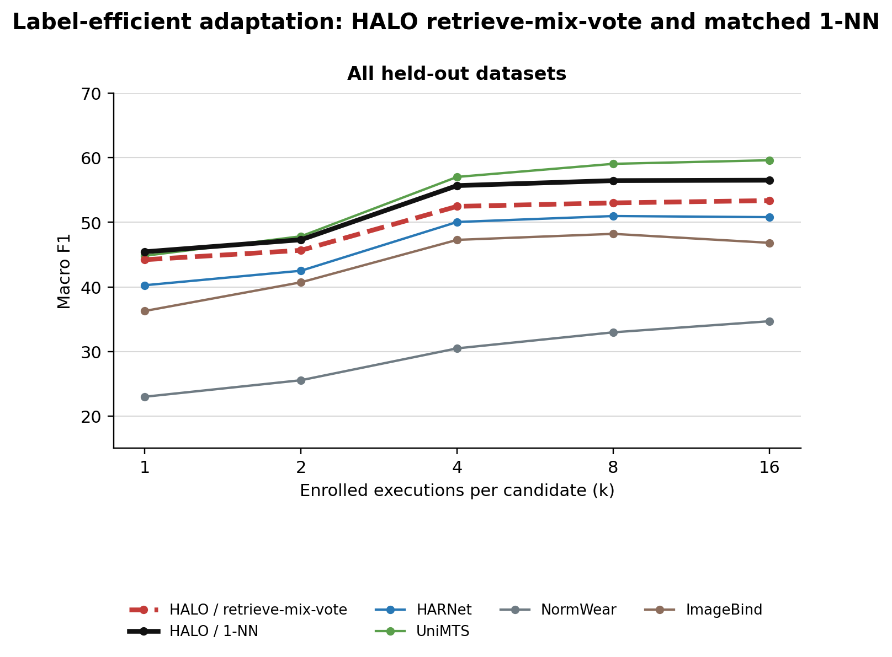

# Current Best Results

> Last updated 2026-08-25. `PB-04-CK-DENSE` is the promoted HALO checkpoint because it gives
> the strongest overall zero-shot point estimate among the HALO checkpoints. Its deployed
> enrollment readout is 1-NN; retrieve-mix-vote is retained and reported as an auxiliary ablation.

**Result set:** `PB-04-CK-DENSE` selected checkpoint. See the
[`Phase-B Version Registry`](PHASE_B_TRAINING_STATUS.md) for the exact checkpoint hash and for how it
differs from the previous `PB-03-PAIRWISE-1NN` model.

## Protocol

The promoted checkpoint is
`training/tokenizer/outputs/e2e_pb04_continuous_dense_35k_20260824/best.pt`. It was trained end to
end from random initialization for 35,000 steps and selected at step 13,000 using the predeclared
development metric. It replaces the fixed physical filterbank with shared continuous physical-time
kernels followed by a dense xyz CNN within each sensor. All other training and evaluation settings
match the fixed-front-end PB-04 run.

External evaluation uses the sealed `adaptation_v1` manifest: seven held-out datasets, five seeds,
execution-disjoint support and query sets, and no test-set training. Here `k` has the standard N-way
k-shot meaning: every candidate receives exactly `k` independent enrolled executions. The query
cohort and candidate roster remain fixed across k. Macro F1 is averaged within each dataset and then
equally across datasets.

The strict assembler validated 5,815 cells from HALO and four author-released checkpoint baselines.
Generated aggregate and per-dataset
tables are in
[`../../eval/adaptation_tables/e2e_pb04_continuous_dense_35k_20260824_best_full/headline_tables.md`](../../eval/adaptation_tables/e2e_pb04_continuous_dense_35k_20260824_best_full/headline_tables.md).

## Zero-Shot Recognition

No labelled target-dataset execution is available at k=0. The table includes only models with a
native open-vocabulary mechanism. HARNet has a released representation checkpoint but no native
open-vocabulary classifier, so it enters the enrollment comparison below but not this table.

| model | all held-out datasets |
|---|---:|
| UniMTS | **25.72** |
| **HALO PB-04-CK-DENSE** | 22.37 |
| ImageBind | 10.00 |
| NormWear | 4.44 |

HALO is not competitive at k=0. The current design should therefore be described as an enrollment
adaptation system, not as a leading semantic zero-shot classifier. Relative to the matched fixed
front end, the continuous model gains 2.10 F1, but the seven-dataset bootstrap interval for that
difference is -2.99 to +7.24; this is a promising point estimate, not a resolved advantage.

## Label-Efficient Adaptation

HALO retrieve-mix-vote inference keeps individual six-second recording rows, combines enrollment with its
fixed 512-row corpus memory, applies the learned scalar correction to every query-memory pair, and
chooses the corrected nearest candidate. For every encoder, the table also reports the same three
non-gradient enrollment rules: pooled-execution 1-NN, support prototypes, and closed-form ridge.
Each sees only the enrolled support executions. Linear-head fitting is excluded from the main table.

| model / readout | k=1 | k=2 | k=4 | k=8 | k=16 |
|---|---:|---:|---:|---:|---:|
| HALO / retrieve-mix-vote | 44.22 | 45.67 | 52.48 | 53.02 | 53.38 |
| **HALO / 1-NN** | 45.44 | 47.31 | 55.70 | 56.47 | 56.53 |
| HALO / prototype | 45.44 | 47.02 | 54.09 | 54.04 | 52.42 |
| HALO / ridge | 44.26 | 46.08 | 54.33 | 55.19 | 55.56 |
| UniMTS / 1-NN | 44.83 | **47.85** | **57.04** | **59.07** | **59.63** |
| UniMTS / prototype | 44.83 | 45.51 | 53.15 | 54.05 | 53.14 |
| UniMTS / ridge | 41.97 | 43.38 | 51.32 | 53.21 | 53.64 |
| HARNet / 1-NN | 40.26 | 42.51 | 50.06 | 50.98 | 50.81 |
| HARNet / prototype | 40.26 | 41.82 | 49.18 | 49.66 | 48.61 |
| HARNet / ridge | 39.61 | 41.66 | 50.31 | 52.27 | 53.25 |
| ImageBind / 1-NN | 36.28 | 40.72 | 47.29 | 48.22 | 46.83 |
| ImageBind / prototype | 36.28 | 39.71 | 43.85 | 42.94 | 41.59 |
| ImageBind / ridge | 35.77 | 40.31 | 46.22 | 47.59 | 47.02 |
| NormWear / 1-NN | 22.99 | 25.55 | 30.49 | 32.97 | 34.69 |
| NormWear / prototype | 22.99 | 23.30 | 26.38 | 26.46 | 25.12 |
| NormWear / ridge | 18.11 | 17.53 | 19.98 | 20.84 | 22.21 |

Seven datasets contribute at k=1 and k=2, six at k=4 and k=8, and five at k=16 because the sealed
protocol never reuses an execution to manufacture a larger support set.

PB-04-CK-DENSE's 1-NN readout is the promoted enrollment mechanism. Retrieve-mix-vote is below 1-NN
at every k and is reported to make that negative result explicit. Relative to the fixed frontend,
continuous kernels improve retrieve-mix-vote by 2.9-5.7 F1 but reduce direct 1-NN by 0.7-1.3 F1.
The per-dataset tables below show that the change is highly dataset-dependent.

## Per-Dataset Performance

The complete per-dataset report contains native zero-shot results and separate `retrieve-mix-vote`,
1-NN, prototype, and ridge curves for the active checkpoint roster on all seven held-out datasets:
[`headline_tables.md`](../../eval/adaptation_tables/e2e_pb04_continuous_dense_35k_20260824_best_full/headline_tables.md#3-per-dataset-performance).
The promoted HALO mechanism is summarized below; `n/a` means the sealed protocol could not form the
requested support count without reusing an execution.

| dataset | k=0 | k=1 | k=2 | k=4 | k=8 | k=16 |
|---|---:|---:|---:|---:|---:|---:|
| Inclusive-HAR | 27.08 | 33.24 | 33.50 | 36.10 | 39.36 | 43.26 |
| MoniPar | 14.63 | 37.18 | 40.91 | 37.19 | 39.83 | 42.27 |
| SPAR | 10.98 | 57.95 | 57.60 | 62.43 | 66.93 | 71.71 |
| TNDA-HAR | 37.44 | 57.15 | 61.94 | 66.25 | 69.37 | 72.88 |
| Upper Limb Use | 5.50 | 16.73 | 12.93 | n/a | n/a | n/a |
| USC-HAD | 26.04 | 56.06 | 60.22 | 63.27 | 51.09 | 52.55 |
| UT Complex | 34.92 | 59.80 | 64.07 | 68.95 | 72.24 | n/a |

## Checkpoint And Readout Selection

The continuous run trained for 35,000 steps in 5,588 seconds. The predeclared development metric
selected step 13,000. Both that checkpoint and the final step were evaluated on the same sealed
manifest. Values below are mean macro F1; positive-k columns average k=1,2,4,8,16.

| checkpoint / readout | k=0 | mean k>0 |
|---|---:|---:|
| PB-03 retrieve-mix-vote | 16.01 | **54.55** |
| PB-03 1-NN | - | 53.30 |
| PB-04 best retrieve-mix-vote | 20.27 | 45.78 |
| PB-04 best 1-NN | - | 53.26 |
| PB-04-CK-DENSE best retrieve-mix-vote | **22.37** | 49.75 |
| PB-04-CK-DENSE best 1-NN | - | 52.29 |
| PB-04-CK-DENSE last retrieve-mix-vote | 20.04 | 37.14 |
| PB-04-CK-DENSE last 1-NN | - | 51.33 |

PB-04-CK-DENSE is promoted for its stronger zero-shot point estimate. Its direct 1-NN enrollment is
slightly below the fixed PB-04 encoder, and the difference intervals cross zero at every k. The
learned mechanism remains below its own 1-NN control, although continuous kernels narrow that gap.
Full tables are in
[`e2e_pb04_continuous_dense_35k_20260824_best_full/headline_tables.md`](../../eval/adaptation_tables/e2e_pb04_continuous_dense_35k_20260824_best_full/headline_tables.md).

## Learned Readout Finding

At every k, PB-04-CK-DENSE retrieve-mix-vote is below PB-04-CK-DENSE 1-NN. This is consistent
with the prior PB-03 decomposition, where most of the apparent native gain came from retaining
individual recording rows rather than from learned score correction. No current experiment shows
that a learned Phase-B mixer improves a matched nearest-neighbor decision.

## Training Health

PB-04-CK-DENSE completed 35,000 finite steps in 93.1 minutes. Development macro F1 rose from 0.2529
before training to 0.3724 at step 13,000, then ended at 0.3009. All continuous kernels remained
active and their mean shape shift stayed below 0.015. External evaluation confirms that the selected
checkpoint is preferable: the final checkpoint loses 10.9-14.6 F1 on retrieve-mix-vote and 0.5-1.7
F1 on direct 1-NN. Late training therefore harms both paths, but primarily the learned correction.

## Current Conclusion

PB-04-CK-DENSE is the current best HALO checkpoint by zero-shot point estimate, but it does not
improve the more important direct 1-NN enrollment curve. For enrollment adaptation, HALO's supported
mechanism remains simple 1-NN over the learned representation. The next clean experiment is the
Siamese-style objective discussed above: end-to-end episodic encoder training with differentiable
soft-nearest-neighbor supervision and exact hard 1-NN inference, with no mixer, vote head, or learned
reranker.
