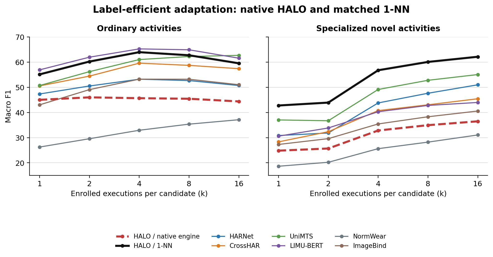
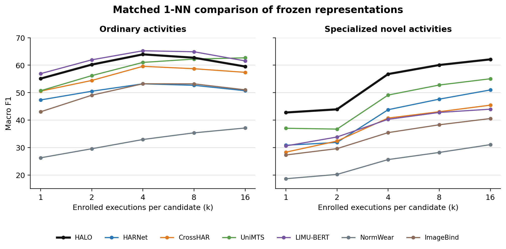
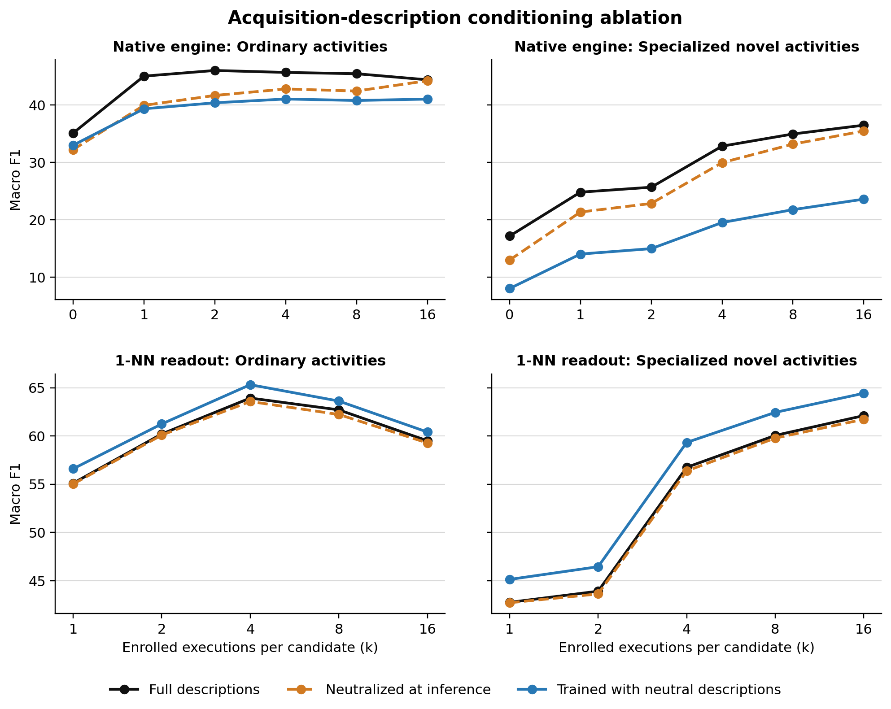
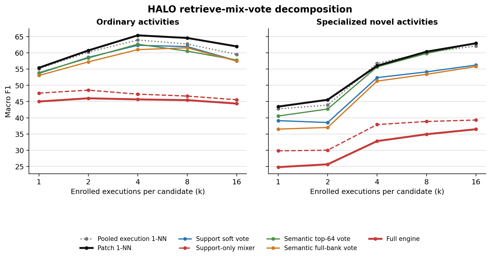

# Current Results

> Last updated 2026-08-23. This file contains only the latest matched evaluation. Dated result
> files are historical records and do not define the current headline.
>
> **Implementation note (2026-08-24):** these are the latest completed results and evaluate the
> retired candidate-residual attention mixer. The newly implemented scalar evidence reranker in
> `docs/design/COMPACT_EVIDENCE_ENGINE.md` has passed smoke testing but has not yet produced a full
> result. Do not attribute the tables below to that new reranker.

## Protocol

The current HALO checkpoint is
`training/tokenizer/outputs/e2e_compact_35k_20260823/best.pt`, selected at step 10,000 by the
predeclared development metric after a 35,000-step run. Evaluation uses the fixed
`adaptation_v1` manifest: seven held-out datasets, five seeds, execution-disjoint support and query,
and no test-set training. CrossHAR and LIMU-BERT were retrained on the current 18-source corpus;
LIMU-BERT includes the corrected accelerometer scale.

The strict result assembler validated 20,957 cells against the manifest, evaluation source, and
checkpoint fingerprints. Macro F1 is averaged over seeds and protocol cells within each dataset,
then equally over datasets. Complete generated tables and matched readout controls are in
[`../../eval/adaptation_tables/e2e_compact_35k_20260823/RESULTS.md`](../../eval/adaptation_tables/e2e_compact_35k_20260823/RESULTS.md).

## Zero-Shot Recognition

No labelled target-dataset execution is available at k=0. Each model uses its native zero-shot
mechanism.

| model | ordinary | specialized novel |
|---|---:|---:|
| CrossHAR | **37.70** | 11.22 |
| **HALO native engine** | 35.11 | 17.17 |
| HARNet | 33.82 | 11.40 |
| UniMTS | 31.98 | **17.37** |
| LIMU-BERT | 30.60 | 10.27 |
| ImageBind | 11.38 | 8.15 |
| NormWear | 5.08 | 3.58 |

## Label-Efficient Adaptation

`k` is the number of independent labelled executions per candidate. Both HALO rows use the same
learned representation: one uses native retrieve-mix-vote and the other uses one-nearest-neighbor.
Every external encoder is frozen and uses the same one-nearest-neighbor rule. This is the primary
deployment comparison because it requires no fitting and sees only the enrolled support executions.
The generated report also gives complete support-only prototype and fitted-linear-head curves for
every model; ridge is retained there as an additional diagnostic.

### Ordinary activities

| model / readout | k=1 | k=2 | k=4 | k=8 | k=16 |
|---|---:|---:|---:|---:|---:|
| LIMU-BERT / 1-NN | **56.91** | **61.95** | **65.24** | **64.89** | 61.55 |
| **HALO / 1-NN** | 55.11 | 60.21 | 63.94 | 62.71 | 59.51 |
| UniMTS / 1-NN | 50.69 | 56.20 | 61.01 | 62.22 | **62.68** |
| CrossHAR / 1-NN | 50.54 | 54.43 | 59.58 | 58.70 | 57.39 |
| HARNet / 1-NN | 47.34 | 50.51 | 53.20 | 52.66 | 50.69 |
| ImageBind / 1-NN | 43.02 | 49.06 | 53.22 | 53.19 | 51.02 |
| **HALO / native engine** | 45.02 | 46.00 | 45.66 | 45.44 | 44.38 |
| NormWear / 1-NN | 26.26 | 29.56 | 32.92 | 35.35 | 37.11 |

### Specialized novel activities

| model / readout | k=1 | k=2 | k=4 | k=8 | k=16 |
|---|---:|---:|---:|---:|---:|
| **HALO / 1-NN** | **42.76** | **43.91** | **56.76** | **60.06** | **62.12** |
| UniMTS / 1-NN | 37.02 | 36.71 | 49.12 | 52.77 | 55.05 |
| HARNet / 1-NN | 30.83 | 31.84 | 43.78 | 47.62 | 50.98 |
| LIMU-BERT / 1-NN | 30.58 | 33.83 | 40.28 | 42.78 | 43.97 |
| CrossHAR / 1-NN | 28.32 | 32.36 | 40.73 | 43.04 | 45.44 |
| ImageBind / 1-NN | 27.29 | 29.59 | 35.43 | 38.29 | 40.56 |
| **HALO / native engine** | 24.82 | 25.68 | 32.83 | 34.94 | 36.48 |
| NormWear / 1-NN | 18.63 | 20.20 | 25.61 | 28.21 | 31.06 |

## Matched Representation Result

The full generated report applies the same nearest, prototype, ridge, and linear-head readouts to
every frozen representation. HALO+1-NN is second to LIMU-BERT on ordinary activities through k=8.
On specialized novel activities, HALO is best at every k under every matched readout. For 1-NN its
specialized curve is 42.76, 43.91, 56.76, 60.06, and 62.12, approximately 5.7-7.6 F1 above the
next-best representation.

## Current Interpretation

The HALO representation is competitive on ordinary activities and strongest on the specialized
novel regime. The native evidence engine does not improve on it: it loses roughly 10-26 F1 to
one-nearest-neighbor over the same features. Current evidence therefore supports the representation
result, but not a claim that learned retrieve-mix-vote is better than simple retrieval.

## Decision: Simple Enrollment Readout

For the current model, **patch-level 1-NN is the design-of-record enrollment rule at k>=1**. End-to-end
training has made the encoder sufficiently discriminative that the nearest enrolled patch is a strong
decision rule. Every tested stage added after that retrieval weakens the result: support soft voting
loses 2.8 ordinary and 5.6 specialized F1, and the learned attention mixer loses a further 11.7-12.9
F1 even when it receives enrolled evidence only. The failure therefore cannot be attributed solely to
noise from the corpus memory bank or acquisition descriptions.

This outcome has clear precedent in few-shot learning. [SimpleShot](https://arxiv.org/abs/1911.04623)
found that normalized nearest-neighbor classification over a strong embedding was competitive with
meta-learners. [Tian et al.](https://www.ecva.net/papers/eccv_2020/papers_ECCV/html/2118_ECCV_2020_paper.php)
found that representation learning followed by a simple linear classifier outperformed contemporary
few-shot methods. [Meta-Baseline](https://openaccess.thecvf.com/content/ICCV2021/html/Chen_Meta-Baseline_Exploring_Simple_Meta-Learning_for_Few-Shot_Learning_ICCV_2021_paper.html)
similarly showed that a whole-classification-trained embedding with nearest-centroid cosine inference
could outperform more elaborate episodic methods, and documented a trade-off between optimizing the
few-shot episode objective and preserving broadly transferable features.

The conclusion is deliberately scoped. It does not make 1-NN a zero-shot rule at k=0, where there is
no enrolled target example, and it does not prove that all evidence aggregation is useless. Semantic
top-64 corpus evidence recovers specialized performance relative to unrestricted corpus voting. It
does establish a strict engineering criterion: a future mixer or memory rule is retained only if it
beats fixed patch-level 1-NN on sealed development episodes, then confirms the gain on the held-out
test protocol. Until that happens, the simple rule is both the strongest result and the clearest
description of HALO's demonstrated adaptation behavior.

## Acquisition-Description Ablation

The config-free arm keeps modality and axis identity but removes device, placement, and gravity
wording. Numerical sensor metadata and the engine's physical compatibility rules are unchanged.
All three arms use the same fixed test manifest. The matched neutral arm used the same 35,000-step
recipe and seed as the full arm; its development-selected checkpoint was step 20,000.

| arm | engine ordinary k=0 | engine ordinary mean k>=1 | engine specialized k=0 | engine specialized mean k>=1 | 1-NN ordinary mean | 1-NN specialized mean |
|---|---:|---:|---:|---:|---:|---:|
| Full descriptions | **35.11** | **45.30** | **17.17** | **30.95** | 60.30 | 53.12 |
| Neutral only at inference | 32.23 | 42.20 | 13.00 | 28.56 | 60.04 | 52.85 |
| Trained and evaluated neutral | 32.99 | 40.51 | 8.05 | 18.79 | **61.44** | **55.56** |

Neutralizing text only at inference changes 1-NN by less than 0.5 F1 at every k, but lowers the
native engine. Training without acquisition descriptions increases 1-NN by 1.3-2.4 F1 at every k;
the gain appears on six of seven test datasets when averaged over k. The same arm substantially
weakens the engine, especially on specialized activities. Thus the current acquisition text is not
the source of HALO's representation advantage and may mildly hinder the representation, while the
retrieve-mix-vote mechanism actively uses it. These conclusions separate encoder and engine effects;
they do not show that the engine uses the descriptions optimally.

This is one matched training seed per arm. Seed replicates are required before treating the
1.3-2.4 F1 representation gain as a paper-level effect.

## Retrieve-Mix-Vote Decomposition

This diagnostic uses the full-description checkpoint and the exact same seven-dataset, five-seed
enrollment manifest as the headline result. Every arm receives identical query rows, enrolled
executions, candidate labels, and (where applicable) corpus memory. Values below average equally
over k=1,2,4,8,16 after averaging within each dataset.

| mechanism | ordinary | specialized novel |
|---|---:|---:|
| Pooled execution 1-NN | 60.30 | 53.12 |
| **Patch-level 1-NN** | **61.61** | **53.66** |
| Enrolled patches, soft vote | 58.81 | 48.08 |
| Enrolled patches, learned mixer | 47.12 | 35.19 |
| Corpus memory only, semantic vote | 17.38 | 8.71 |
| Enrollment + corpus with uniform corpus votes | 58.52 | 47.41 |
| Enrollment + semantic corpus top-64 vote | 58.64 | 52.35 |
| Enrollment + semantic corpus full-bank vote | 58.04 | 46.80 |
| Full engine | 45.30 | 30.95 |

The encoder and patch retrieval are not the bottleneck: patch-level 1-NN slightly exceeds the
pooled execution control. Replacing hard retrieval with a soft vote costs 2.8 ordinary and 5.6
specialized F1. Semantic corpus evidence is useful when restricted to the top 64 rows, recovering
4.3 specialized F1 relative to the support-only soft vote. Extending that semantic vote to the
whole corpus bank loses 5.5 specialized F1.

The largest defect is the learned attention mixer. Relative to its own full-bank base vote, it loses
12.7 ordinary and 15.8 specialized F1. The support-only mixer also loses 11.7 and 12.9 F1 relative
to the support-only soft vote, so this regression does not require corpus noise or acquisition-text
conditioning. The trained mixer is systematically overriding useful retrieval decisions.

The raw 360-cell artifact is
[`../../eval/adaptation_results/e2e_compact_35k_20260823/halo_engine_decomposition.json`](../../eval/adaptation_results/e2e_compact_35k_20260823/halo_engine_decomposition.json).
