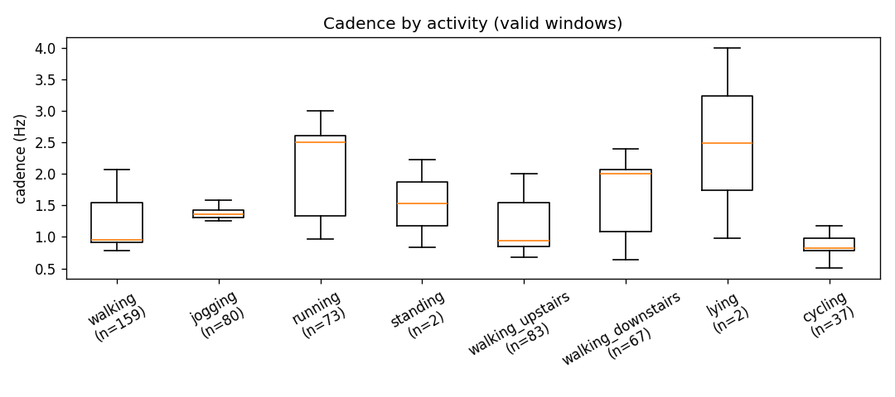
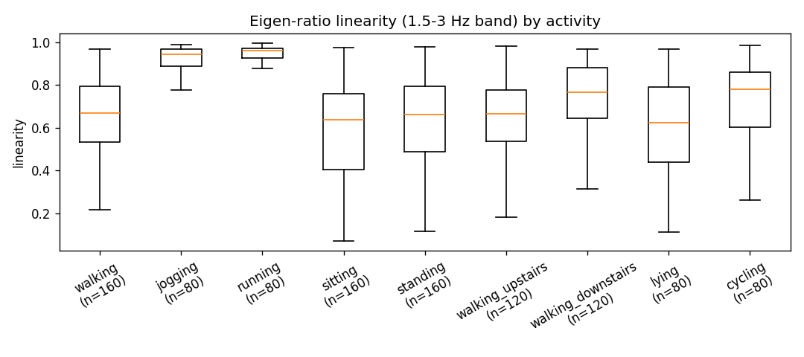
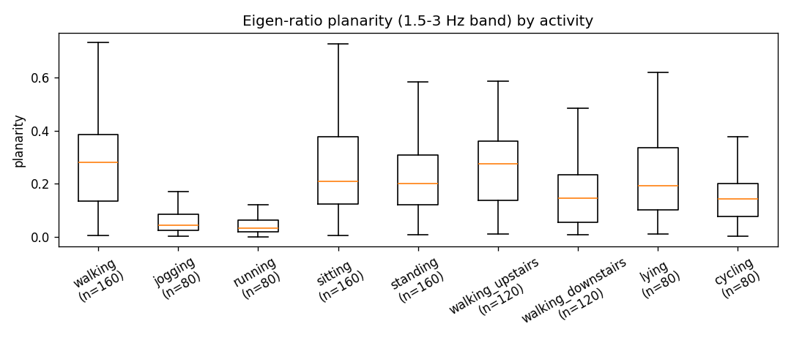
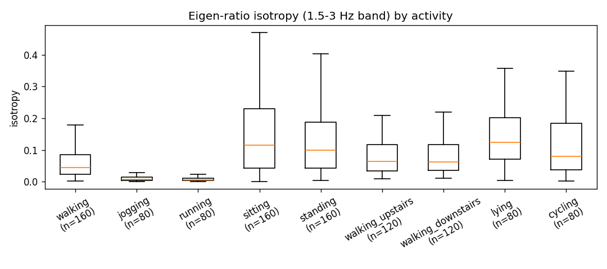

# M0 robustness probe — invariance vs discriminability

Probe sample: 1040 windows from 4 streams (motionsense/phone_front_pocket, pamap2/watch_wrist, realworld/phone_waist, shoaib/phone_right_pocket), seed 20260717.

## Invariance (mean cosine similarity / mean relative-L2 drift; cadence = exp(-|octave err|) / octave err)

| family | gain | rot_so3 | rot_yaw | resample_30hz | time_warp |
|---|---|---|---|---|---|
| raw_band_energy | 0.999 / 0.057 | 0.956 / 0.252 | 0.982 / 0.157 | 0.996 / 0.091 | 0.997 / 0.066 |
| grav_band_energy | 0.999 / 0.063 | 1.000 / 0.000 | 1.000 / 0.000 | 0.995 / 0.102 | 0.996 / 0.075 |
| eigen_ratios | 1.000 / 0.000 | 1.000 / 0.000 | 1.000 / 0.000 | 0.937 / 0.232 | 0.949 / 0.257 |
| coherence | 1.000 / 0.000 | 1.000 / 0.000 | 1.000 / 0.000 | 0.991 / 0.106 | 0.971 / 0.287 |
| spectral_shape | 1.000 / 0.000 | 1.000 / 0.000 | 1.000 / 0.000 | 0.999 / 0.079 | 0.999 / 0.065 |
| cadence | 1.000 / 0.000 | 1.000 / 0.000 | 1.000 / 0.000 | 0.913 / 0.091 | 0.979 / 0.021 |
| invariant_union | 0.999 / 0.054 | 1.000 / 0.000 | 1.000 / 0.000 | 0.995 / 0.100 | 0.996 / 0.082 |

## Discriminability (kNN balanced accuracy)

| family | within-dataset (subject-disjoint) | cross-dataset (leave-one-out) |
|---|---|---|
| raw_band_energy | 0.853 | 0.458 |
| grav_band_energy | 0.807 | 0.506 |
| eigen_ratios | 0.470 | 0.205 |
| coherence | 0.363 | 0.210 |
| spectral_shape | 0.466 | 0.279 |
| cadence | 0.579 | 0.369 |
| invariant_union | 0.772 | 0.456 |

Notes: `raw_band_energy` is the deliberate fragile baseline. `time_warp` is a
deformation-stability check (smooth drift expected, exact invariance NOT expected,
except cadence which is analytically corrected by the warp factor). The `12-25 Hz`
band is truncated under `resample_30hz` by Nyquist — drift there is honest.

## A3-target separation plots

